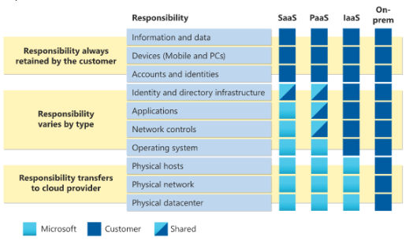

```{r setup, include=FALSE}
knitr::opts_chunk$set(echo = FALSE,
                      out.extra = "")  # This forces knitr to label all figures.
```

# <u>Módulo 1</u>

## *Introducción a la informática en la nube*

La informática en la nube es la presentación de servicios informáticos a través de internet. Estos incluyen infraestructura en TI común (máquinas virtuales, almacenamiento, bases de datos y redes) y amplían las ofertas de TI tradicionales sumando valores como Internet de las cosas (IoT), aprendizaje automático (ML) e inteligencia artificial (IA).
Si la informática en la nube necesita aumentar rápidamente la infraestructura de TI, no tiene que esperar a crear un centro de datos, puede usar la nube para expandir rápidamente la superficie de TI.
Básicamente, la informática en la nube funciona como un medio para ejecutar un software eligiendo potencia y características necesarias para el mismo. Este equipo se encuentra en un centro de datos de un proveedor de nube (no físicamente).
Se pagan por los servicios únicamente sin necesidad de realizar mantenimiento al equipo (lo realiza otra persona). Las ofertas de los proveedores varían entre sí, pero los servicios básicos que todos otorgan son la potencia de proceso y almacenamiento. Se definirán a continuación para entender de qué se trata:

* Potencia de proceso: volumen de proceso que puede asumir el equipo, por ejemplo la cantidad de RAM y el procesador más reciente que tendría un equipo físico. Con la informática de nube, puede añadir o quitar potencia según los procesos que realice ahorrando costos (paga los recursos que usa).
* Almacenamiento: volumen de datos que puede guardar el equipo, por ejemplo un equipo tradicional tiene una cantidad de espacio limitado que puede agotarse con el tiempo. Con la información en la nube, puede solicitar más almacenamiento según las necesidades y los proveedores se encargan del mantenimiento del equipo (copias de seguridad, sistema operativo actualizado, correcto funcionamiento, etc.).

## *Descripción del modelo de responsabilidad compartida*

Con el modelo de responsabilidad compartida, se separan las responsabilidades entre el proveedor de servicios y el consumidor. La seguridad física, alimentación, refrigeración y conectividad de red son responsabilidad del proveedor (el consumidor no tiene acceso al centro de datos). El consumidor es el responsable de los datos e información almacenados en la nube y de la seguridad de acceso.
Si usa una base de datos SQL en la nube, el proveedor de servicios será el responsable de mantener la base de datos real. Pero sigue siendo responsabilidad del consumidor  que los datos se ingieran en la base de datos. Si implementa una máquina virtual con una base de datos SQL en ella, será el responsable  de las revisiones y actualizaciones de la base de datos, mantenimiento de los datos e información almacenadas en ella.
Con un centro de datos local será el responsable de todo. El modelo de responsabilidad compartida está vinculado a los tipos de servicio en la nube: infraestructura como servicio (IaaS), plataforma como servicio (PaaS) y software como servicio (SaaS). Se procede a desarrollar los campos de estos servicios:

* Iaas: mayor responsabilidad en el consumidor mientras que el proveedor es responsable de los conceptos básicos de seguridad física, energía y conectividad.
* Saas: mayor responsabilidad en el proveedor.
* PaaS: se encuentra entre IaaS y SaaS, distribuyendo uniformemente la responsabilidad entre proveedor y consumidor.

En el siguiente diagrama se resaltan las responsabilidades de cada parte en función del tipo de servicio en la nube:

```{r, echo=FALSE, out.width='90%'}

```

Responsabilidades del consumidor:

* Información y datos almacenados en la nube.
* Dispositivos que se pueden conectar a la nube(teléfonos móviles, equipos, etc.).
* Cuentas e identidades de las personas, servicios y dispositivos de la organización.

Responsabilidades del proveedor de nube:

* Centro de datos físicos.
* Red física.
* Hosts físicos.

El modelo de servicio definirá la responsabilidad de cosas como:

* Sistemas operativos.
* Controles de red.
* Aplicaciones.
* Identidad e infraestructura.