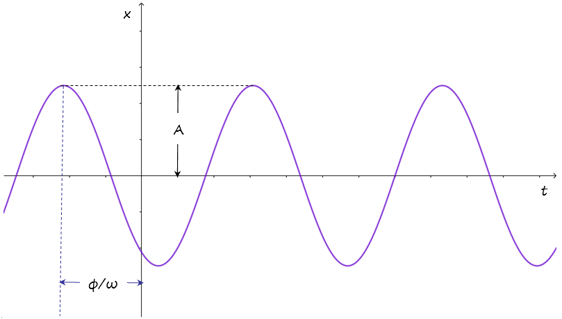
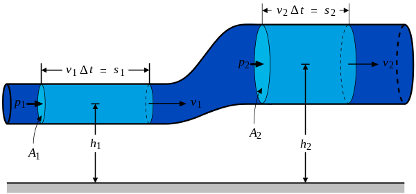

```{r setup, include=FALSE}
knitr::opts_chunk$set(echo = FALSE,
                      out.extra = "")  # This forces knitr to label all figures.
```

# Primera sección

## Movimiento Armónico Simple

La ecuación del movimiento armónico simple es:

\begin{equation}
y = A cos(\omega t + \phi)
\end{equation}

{width=300px height=225px}

## Ecuación de Bernoulli

La ecuación de Bernoulli es:

\begin{equation}
P_1 + \frac{1}{2} \rho (v_1)^2 + \rho g h_1 = P_2 + \frac{1}{2} \rho (v_2)^2 + \rho g h_2 
\end{equation}

{width=300px height=150px}

## PBI per cápita de Argentina

La tabla \ref{tab:table} muestra la evolución del PBI per cápita de Argentina durante el período entre 2011 y 2021

```{r table}

datos <- data.frame(
  "Año" = c(2021,2020,2019,2018,2017,2016,2015,2014,2013,2012,2011),
  "PBI"= c(10.625,8.574,10.054,11.786,14.618,12.773,14.895,3.209,14.489,13.890,12.788)
)

knitr::kable(head(datos), 
             format = "latex",
             caption = "PBI per cápita de Argentina entre 2011 y 2021")
```